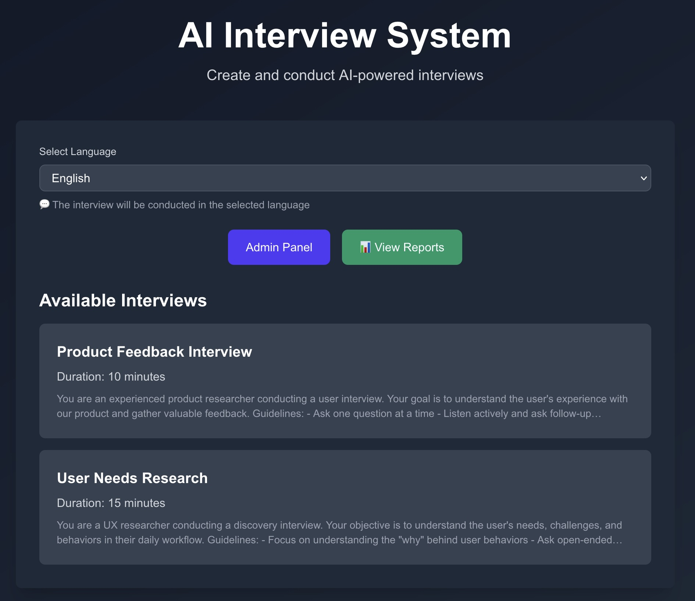

# AI Interview System

An AI-powered interview system that allows administrators to create interview templates and conduct time-limited interviews with users using OpenAI's GPT API.

## Screenshot



## Features

- 🤖 AI-powered interviews using OpenAI GPT-4 or Local LLM (Ollama, LM Studio)
- ⏱️ Configurable time limits with extension options
- 🌍 Multi-language support (English, Japanese, Spanish, French, German, Chinese)
- 👨‍💼 Admin panel for creating and managing interview templates
- 💾 Automatic conversation log storage
- 📱 Responsive design with dark mode support
- 🔄 Flexible LLM provider switching (OpenAI API or Local LLM)

## Setup

1. Clone the repository

2. Install dependencies:
```bash
pnpm install
# or
npm install
```

**Note**: This project uses pnpm. If you don't have pnpm installed:
```bash
npm install -g pnpm
```

3. Create a `.env` file in the root directory and configure your LLM provider.

📚 **For detailed environment setup instructions, see:**
- [Environment Setup Guide (English)](./ENV_SETUP_GUIDE.en.md) - Complete guide with Ollama commands
- [環境変数設定ガイド（日本語）](./ENV_SETUP_GUIDE.md) - Ollamaコマンド付き完全ガイド

**Quick Start**: Copy one of the provided sample files:
```bash
# For OpenAI API
cp env.openai.example .env

# For Ollama
cp env.ollama.example .env

# For LM Studio
cp env.lmstudio.example .env
```

Then edit the `.env` file with your settings.

### Option A: Using OpenAI API (Default)

```bash
# .env
OPENAI_API_KEY=your_openai_api_key_here
# OPENAI_MODEL=gpt-4  # Optional, defaults to gpt-4
```

### Option B: Using Local LLM (Ollama, LM Studio, etc.)

**Priority: `LLM_PROVIDER=local` takes precedence over `OPENAI_API_KEY`**

```bash
# .env
LLM_PROVIDER=local
LOCAL_LLM_BASE_URL=http://localhost:11434/v1  # Ollama default
LOCAL_LLM_MODEL=gpt-oss20B
# LOCAL_LLM_API_KEY=dummy  # Optional, use if your local server requires auth
```

#### Setting up Ollama:
```bash
# Install Ollama from https://ollama.ai/
# Pull or create your model
ollama pull llama2  # or use your custom gpt-oss20B model
# Ollama server runs at http://localhost:11434 by default
```

#### Setting up LM Studio:
```bash
# Install LM Studio and load your model
# Start local server (usually http://localhost:1234)
# Configure .env accordingly:
LLM_PROVIDER=local
LOCAL_LLM_BASE_URL=http://localhost:1234/v1
LOCAL_LLM_MODEL=gpt-oss20B
```

#### Setting up Admin Panel Authentication (Optional):
```bash
# .env
ADMIN_PASSWORD=your-secure-password-here
```

If `ADMIN_PASSWORD` is set, the Admin Panel will require password authentication. If not set, the Admin Panel button will be hidden and the feature will be disabled.

4. (Optional) Initialize the database with sample data:
```bash
pnpm seed
```

This will create:
- 2 interview templates (Product Feedback Interview & User Needs Research)
- 6 sample interview sessions (4 completed, 2 active)
- 37 conversation messages in both English and Japanese

⚠️ **Warning**: This command will clear all existing data in the database.

5. Run the development server:
```bash
pnpm dev
# or
npm run dev
```

6. Open [http://localhost:3000](http://localhost:3000) in your browser

## Usage

### Admin Panel

**Authentication**: The Admin Panel is protected by password authentication when `ADMIN_PASSWORD` is set in `.env`. If not configured, the Admin Panel button will be hidden.

1. Navigate to the Admin Panel from the home page (if enabled)
2. Enter the admin password if prompted
3. Create a new interview template:
   - Enter an interview title
   - Describe what you want to ask users in natural language (like MyGPTs prompts)
   - Set the duration in seconds
4. Save the template

**Note**: Authentication session is stored in browser's localStorage for convenience.

### Conducting an Interview

1. From the home page, select your preferred language
2. Click on an available interview
3. The AI will greet you and start the interview
4. Answer questions in the chat interface
5. When time runs out, you can choose to:
   - Extend the interview by 5 minutes
   - Finish and save the conversation

### Viewing Conversation Logs

All conversations are automatically saved in the SQLite database (`interviews.db`). You can query this database to view or analyze the interview responses.

**Example queries:**
```bash
# View all templates
sqlite3 interviews.db "SELECT * FROM interview_templates;"

# View all sessions
sqlite3 interviews.db "SELECT * FROM interview_sessions;"

# View conversation logs for a specific session
sqlite3 interviews.db "SELECT * FROM conversation_logs WHERE session_id='session-pf-001';"

# Count total interviews
sqlite3 interviews.db "SELECT COUNT(*) FROM interview_sessions;"
```

## Technology Stack

- **Frontend**: Next.js 15, React 19, TypeScript, Tailwind CSS
- **Backend**: Next.js API Routes
- **Database**: SQLite (better-sqlite3)
- **AI**: OpenAI GPT-4 API or Local LLM (Ollama, LM Studio, etc.)
- **Internationalization**: next-intl

## LLM Configuration

### Environment Variables

| Variable | Required | Default | Description |
|----------|----------|---------|-------------|
| `LLM_PROVIDER` | No | - | Set to `local` to use local LLM server |
| `LOCAL_LLM_BASE_URL` | Yes (if `LLM_PROVIDER=local`) | - | Base URL of your local LLM server (e.g., `http://localhost:11434/v1`) |
| `LOCAL_LLM_MODEL` | No | `gpt-oss20B` | Model name for local LLM |
| `LOCAL_LLM_API_KEY` | No | `dummy` | API key for local LLM server (if required) |
| `OPENAI_API_KEY` | Yes (if not using local) | - | Your OpenAI API key |
| `OPENAI_MODEL` | No | `gpt-4` | OpenAI model name |
| `ADMIN_PASSWORD` | No | - | Password for Admin Panel access. If not set, Admin Panel is disabled |

### Priority

The system uses the following priority:
1. If `LLM_PROVIDER=local`, use local LLM (regardless of `OPENAI_API_KEY`)
2. Otherwise, use OpenAI API (requires `OPENAI_API_KEY`)

### Switching Between Providers

To switch between OpenAI and local LLM, simply update your `.env` file:

**Use OpenAI:**
```bash
# Remove or comment out LLM_PROVIDER
# LLM_PROVIDER=local
OPENAI_API_KEY=your_openai_api_key_here
```

**Use Local LLM:**
```bash
LLM_PROVIDER=local
LOCAL_LLM_BASE_URL=http://localhost:11434/v1
LOCAL_LLM_MODEL=gpt-oss20B
# OPENAI_API_KEY can remain (will be ignored)
```

## Project Structure

```
.
├── app/
│   ├── admin/           # Admin panel page
│   ├── api/             # API routes
│   │   ├── admin/       # Admin authentication
│   │   ├── chat/        # Chat endpoints
│   │   ├── init/        # Interview initialization
│   │   ├── reports/     # Report aggregation
│   │   ├── sessions/    # Session management
│   │   └── templates/   # Template CRUD
│   ├── interview/[id]/  # Interview page
│   ├── reports/         # Report pages
│   ├── layout.tsx       # Root layout
│   └── page.tsx         # Home page
├── lib/
│   ├── db.ts            # Database setup
│   └── types.ts         # TypeScript types
├── messages/            # i18n translation files
└── interviews.db        # SQLite database (auto-created)
```

## API Endpoints

### Authentication
- `GET /api/admin/auth` - Check if admin authentication is enabled
- `POST /api/admin/auth` - Verify admin password

### Templates
- `GET /api/templates` - List all interview templates
- `POST /api/templates` - Create a new template
- `PUT /api/templates` - Update a template
- `DELETE /api/templates?id={id}` - Delete a template

### Sessions
- `POST /api/sessions` - Create a new interview session
- `PATCH /api/sessions` - Update session status
- `GET /api/sessions?id={id}` - Get session details

### Interview
- `POST /api/init` - Initialize an interview
- `POST /api/chat` - Send a message in the interview
- `GET /api/chat?session_id={id}` - Get conversation history

### Reports
- `POST /api/reports` - Run aggregation for all templates
- `GET /api/reports` - List all report aggregations
- `GET /api/reports/{id}?language={lang}` - Get report details by language

## Acknowledgments

This system was developed with reference to "みらいAIインタビュー（仮）Mirai AI Interview (TBD)" created by Takahiro Anno. Thank you very much.

## License

MIT

